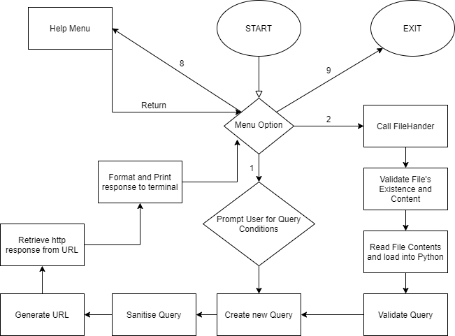

# Linguo Liberated  

---

Original Repo at: [https://github.com/eric-chew/Linguo-Liberated](https://github.com/eric-chew/Linguo-Liberated)

### Description  

Linguo Liberated is a word finding Python terminal application utilising the [Datamuse API](https://www.datamuse.com/api/).
The user interfaces with the app through the command line where they can use either:  
- Prompts from the app in the first user menu
- Upload a file for the app to consume in the second user menu  

Regardless of the input method, the application will generate a Query object which will be passed to a specialised DatamuseHandler to interface with the API.
In the case of file upload, a FileHandler implementation will perform the actions required to ensure it can be correctly consumed by the application.  

The FileHandler class will check the user enters an existing file and that the contents and structure of the file is able to be turned into a Query.  

A Query is generated from the CLI or file upload and will perform the necessary data sanitisation required for the API to safely and correctly consume it.  

The DatamuseHandler will then take the Query object and generate a URL to send to the Datamuse API. The DatamuseHandler will take the response (gracefully handling errors/unexpected responses) and print the result to the terminal.  

Linguo Liberated makes use of the external packages found in [requirements.txt](./requirements.txt):
- mypy: for checking type hints
- flake8: for style enforcement
- requests: for handling http requests and responses between the API and client

Linguo Liberated also uses the following standard libraries:  
- json: to handle the API response
- os: to perform checks used by the FileHandler class
- `__future__`: for type hinting
- unittest: for automatic testing/continuous integration

The main menu will also contain a prompt to the following help menu:
```
Currently, three search conditions are supported:
1. 'means like': search based on semantics
2. 'sounds like': search based on phonetics
3. 'spelled like': search based on orthography

When filling in these conditions, it is okay to leave one blank if you want.

You can also use the following wildcards to enhance your search:
* : Matches any number of characters
? : Matches exactly one character
# : Matches exactly one consonant
@ : Matches exactly one vowel

Linguo Liberated currently supports two modes of searching:
1. Manually inputting search conditions from the menu
2. Uploading a query from a file
```

An example file [example_input.txt](src/example_file.txt) is provided in the `src/` directory

Application Flow Chart:  


---

###Installation and Use  

Linguo Liberated was written in python3.8 which can be installed using:
```bash
apt-get install python3.8
```  

To install the required packages to run the app, use:
```bash
pip install -r requirements.txt
```

Then from the root of the repo, the app can be run using:
```bash
python3.8 src/main.py
```

Note on file upload mode:
The path supplied will be relative to the current working directory. So to use the `example_input.txt` when running from the root of the repo, you would type:
```
src/example_file.txt
```
when prompted
